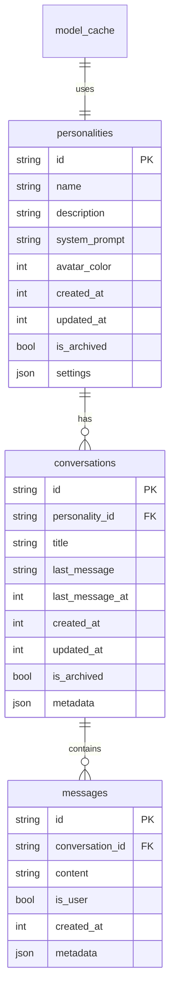

# Database Schema

**Last Updated**: 2025-07-10
**Status**: Approved
**Author**: App Project Architect

## Overview

The AI Chatbot uses SQLite for local data persistence. The schema is designed for efficiency, data integrity, and future extensibility.

## Schema Version

Current Version: 1.0.0

## Tables

### personalities

Stores AI personality configurations.

```sql
CREATE TABLE personalities (
    id TEXT PRIMARY KEY,
    name TEXT NOT NULL,
    description TEXT,
    system_prompt TEXT NOT NULL,
    avatar_color INTEGER NOT NULL,
    created_at INTEGER NOT NULL,
    updated_at INTEGER NOT NULL,
    is_archived INTEGER DEFAULT 0,
    settings TEXT -- JSON string for extensibility
);

CREATE INDEX idx_personalities_archived ON personalities(is_archived);
CREATE INDEX idx_personalities_updated ON personalities(updated_at);
```

### conversations

Stores conversation sessions.

```sql
CREATE TABLE conversations (
    id TEXT PRIMARY KEY,
    personality_id TEXT NOT NULL,
    title TEXT NOT NULL,
    last_message TEXT,
    last_message_at INTEGER,
    created_at INTEGER NOT NULL,
    updated_at INTEGER NOT NULL,
    is_archived INTEGER DEFAULT 0,
    metadata TEXT, -- JSON string
    FOREIGN KEY (personality_id) REFERENCES personalities(id) ON DELETE CASCADE
);

CREATE INDEX idx_conversations_personality ON conversations(personality_id);
CREATE INDEX idx_conversations_updated ON conversations(updated_at);
CREATE INDEX idx_conversations_archived ON conversations(is_archived);
```

### messages

Stores individual messages.

```sql
CREATE TABLE messages (
    id TEXT PRIMARY KEY,
    conversation_id TEXT NOT NULL,
    content TEXT NOT NULL,
    is_user INTEGER NOT NULL,
    created_at INTEGER NOT NULL,
    metadata TEXT, -- JSON for attachments, etc.
    FOREIGN KEY (conversation_id) REFERENCES conversations(id) ON DELETE CASCADE
);

CREATE INDEX idx_messages_conversation ON messages(conversation_id);
CREATE INDEX idx_messages_created ON messages(created_at);
```

### settings

Stores app-wide settings.

```sql
CREATE TABLE settings (
    key TEXT PRIMARY KEY,
    value TEXT NOT NULL,
    updated_at INTEGER NOT NULL
);
```

### model_cache

Tracks downloaded AI models.

```sql
CREATE TABLE model_cache (
    id TEXT PRIMARY KEY,
    model_name TEXT NOT NULL,
    model_version TEXT NOT NULL,
    file_path TEXT NOT NULL,
    file_size INTEGER NOT NULL,
    downloaded_at INTEGER NOT NULL,
    last_used_at INTEGER NOT NULL,
    metadata TEXT
);

CREATE INDEX idx_model_cache_name ON model_cache(model_name);
```

## Data Types

- **id**: UUID v4 strings
- **timestamps**: Unix timestamps (milliseconds)
- **booleans**: INTEGER (0 or 1)
- **JSON**: TEXT field with JSON string
- **colors**: INTEGER (ARGB format)

## Relationships



## Migration Strategy

### Version Control

```sql
CREATE TABLE schema_migrations (
    version INTEGER PRIMARY KEY,
    applied_at INTEGER NOT NULL
);
```

### Migration Files

- `001_initial_schema.sql`
- `002_add_model_cache.sql`
- etc.

## Queries

### Common Queries

```sql
-- Get all active personalities
SELECT * FROM personalities 
WHERE is_archived = 0 
ORDER BY updated_at DESC;

-- Get conversations for a personality
SELECT * FROM conversations 
WHERE personality_id = ? AND is_archived = 0 
ORDER BY updated_at DESC;

-- Get messages for a conversation
SELECT * FROM messages 
WHERE conversation_id = ? 
ORDER BY created_at ASC;

-- Update last message in conversation
UPDATE conversations 
SET last_message = ?, last_message_at = ?, updated_at = ? 
WHERE id = ?;
```

## Indexing Strategy

1. **Primary Keys**: Automatically indexed
2. **Foreign Keys**: Indexed for join performance
3. **Timestamp Fields**: Indexed for sorting
4. **Archive Flags**: Indexed for filtering

## Data Retention

- Messages: Kept indefinitely
- Archived items: Soft delete only
- Model cache: LRU eviction when space needed

## Backup Strategy

1. **Manual Export**: JSON export functionality
2. **Auto-backup**: Optional daily backup to device storage
3. **Migration**: Import/export between devices

## Performance Considerations

1. **Batch Inserts**: For message history
2. **Lazy Loading**: Paginated message loading
3. **Index Optimization**: Regular ANALYZE
4. **Vacuum**: Periodic database cleanup

## Security

1. **SQL Injection**: Parameterized queries only
2. **Encryption**: Optional database encryption
3. **Access Control**: App-level only

## Future Considerations

1. **Full-Text Search**: Message content search
2. **Analytics Tables**: Usage statistics
3. **Sync Tables**: For future cloud sync
4. **Plugin Tables**: For extension system