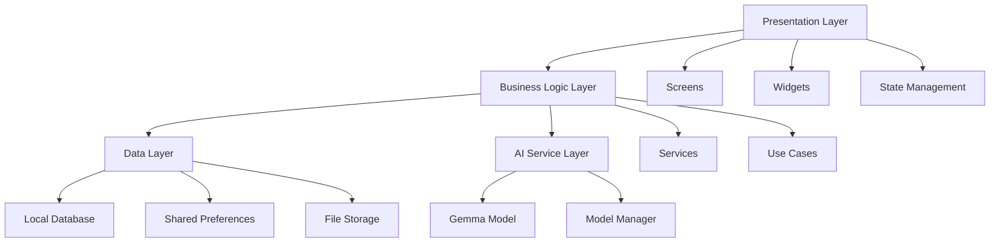

# Architecture Overview

**Last Updated**: 2025-07-10
**Status**: Approved
**Author**: App Project Architect

## Overview

The AI Chatbot application follows a clean architecture pattern with clear separation of concerns, enabling maintainability, testability, and scalability.

## Design Principles

1. **Offline-First**: All core functionality works without internet
2. **Privacy-Focused**: No data leaves the device
3. **Modular Design**: Clear separation between features
4. **Responsive UI**: Adapts to different screen sizes
5. **Performance**: Optimized for mobile constraints

## Architecture Diagram

## Layer Details

### Presentation Layer
**Purpose**: Handle UI rendering and user interactions
**Components**:
- Screens (Chat, Personalities, Settings)
- Reusable Widgets
- State Management (Provider)

### Business Logic Layer
**Purpose**: Implement app-specific business rules
**Components**:
- Service classes
- Use case implementations
- Data transformation

### Data Layer
**Purpose**: Handle data persistence and retrieval
**Components**:
- SQLite database (conversations, messages)
- SharedPreferences (settings)
- File storage (AI models)

### AI Service Layer
**Purpose**: Manage AI model loading and inference
**Components**:
- Model loading and caching
- Inference execution
- Response streaming

## Data Flow

1. User inputs message in Chat Screen
2. ChatController validates and processes input
3. AIService loads personality context
4. Gemma model generates response
5. Response saved to database
6. UI updates with new message

## Key Components

### AIService
- Manages Gemma model lifecycle
- Handles inference requests
- Implements response streaming
- Manages model memory

### PersonalityService
- CRUD operations for personalities
- System prompt management
- Personality switching logic

### PermissionService
- Permission request handling
- Permission status tracking
- Platform-specific implementations

### DatabaseService
- SQLite database management
- Migration handling
- Query optimization

## Security Considerations

1. **Local Storage Encryption**: Sensitive data encrypted at rest
2. **Permission Boundaries**: Each permission requested only when needed
3. **Model Isolation**: AI model runs in isolated context
4. **No Network Calls**: Prevents data exfiltration

## Performance Optimizations

1. **Lazy Loading**: Models loaded on-demand
2. **Response Streaming**: Real-time UI updates
3. **Database Indexing**: Fast query performance
4. **Memory Management**: Automatic model unloading

## Scalability Plan

### Current (v1.0)
- Single AI model support
- Local storage only
- Basic personality system

### Future (v2.0)
- Multiple model support
- Cloud backup option
- Advanced personality features
- Plugin system for extensions

## Technology Stack

- **Framework**: Flutter 3.x
- **Language**: Dart 3.x
- **AI Model**: Gemma 2B (TFLite)
- **Database**: SQLite
- **State Management**: Provider
- **Dependency Injection**: Manual

## Decision Rationale

### Why Flutter?
- True cross-platform capability
- Excellent performance
- Rich widget library
- Strong community support

### Why Gemma?
- Optimized for mobile devices
- Good performance/size ratio
- Google's ongoing support
- TFLite integration

### Why Provider?
- Simple and lightweight
- Official Flutter recommendation
- Easy to understand
- Sufficient for app complexity