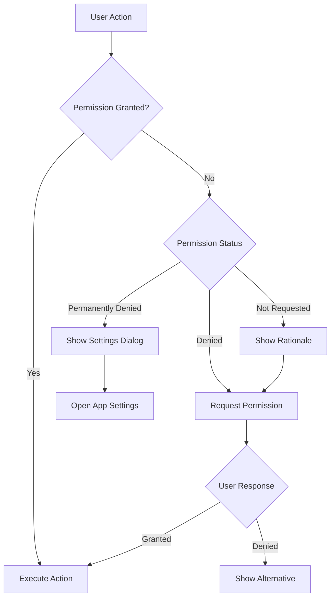

# Permission Handling Implementation

**Last Updated**: 2025-07-10
**Priority**: HIGH
**Estimated Time**: 2-3 hours

## Overview

Complete implementation guide for handling all device permissions with proper UI/UX.

## Permission Flow Diagram



## Implementation by Feature

### 1. Calendar Integration

```dart
// lib/features/calendar_integration.dart
import 'package:device_calendar/device_calendar.dart';
import '../services/permission_service.dart';

class CalendarIntegration {
  final DeviceCalendarPlugin _calendarPlugin = DeviceCalendarPlugin();
  final PermissionService _permissionService = PermissionService();
  
  Future<List<Calendar>> getCalendars(BuildContext context) async {
    // Request permission
    final hasPermission = await _permissionService.requestPermissionWithUI(
      context,
      'calendar',
    );
    
    if (!hasPermission) {
      throw PermissionException('Calendar permission denied');
    }
    
    // Get calendars
    final result = await _calendarPlugin.retrieveCalendars();
    return result.data ?? [];
  }
  
  Future<void> createEvent({
    required String title,
    required DateTime start,
    required DateTime end,
    String? description,
    String? location,
  }) async {
    final calendars = await getCalendars(context);
    if (calendars.isEmpty) return;
    
    final event = Event(
      calendars.first.id,
      title: title,
      start: TZDateTime.from(start, local),
      end: TZDateTime.from(end, local),
      description: description,
      location: location,
    );
    
    await _calendarPlugin.createOrUpdateEvent(event);
  }
  
  Future<List<Event>> getEvents(
    DateTime start,
    DateTime end,
  ) async {
    final calendars = await getCalendars(context);
    final allEvents = <Event>[];
    
    for (final calendar in calendars) {
      final result = await _calendarPlugin.retrieveEvents(
        calendar.id,
        RetrieveEventsParams(
          startDate: start,
          endDate: end,
        ),
      );
      allEvents.addAll(result.data ?? []);
    }
    
    return allEvents;
  }
}
```

### 2. Contacts Integration

```dart
// lib/features/contacts_integration.dart
import 'package:flutter_contacts/flutter_contacts.dart';
import '../services/permission_service.dart';

class ContactsIntegration {
  final PermissionService _permissionService = PermissionService();
  
  Future<List<Contact>> getContacts(BuildContext context) async {
    // Request permission
    final hasPermission = await _permissionService.requestPermissionWithUI(
      context,
      'contacts',
    );
    
    if (!hasPermission) {
      throw PermissionException('Contacts permission denied');
    }
    
    // Get contacts
    return await FlutterContacts.getContacts(
      withProperties: true,
      withPhoto: true,
    );
  }
  
  Future<Contact?> selectContact(BuildContext context) async {
    final contacts = await getContacts(context);
    
    if (context.mounted) {
      return await showDialog<Contact>(
        context: context,
        builder: (context) => ContactPickerDialog(contacts: contacts),
      );
    }
    return null;
  }
  
  Future<void> createContact({
    required String firstName,
    required String lastName,
    String? phone,
    String? email,
  }) async {
    final contact = Contact(
      name: Name(first: firstName, last: lastName),
      phones: phone != null ? [Phone(phone)] : [],
      emails: email != null ? [Email(email)] : [],
    );
    
    await contact.insert();
  }
}

// Contact Picker Dialog
class ContactPickerDialog extends StatefulWidget {
  final List<Contact> contacts;
  
  const ContactPickerDialog({super.key, required this.contacts});
  
  @override
  State<ContactPickerDialog> createState() => _ContactPickerDialogState();
}

class _ContactPickerDialogState extends State<ContactPickerDialog> {
  String _searchQuery = '';
  
  List<Contact> get filteredContacts {
    if (_searchQuery.isEmpty) return widget.contacts;
    
    return widget.contacts.where((contact) {
      final name = contact.displayName.toLowerCase();
      return name.contains(_searchQuery.toLowerCase());
    }).toList();
  }
  
  @override
  Widget build(BuildContext context) {
    return Dialog(
      child: Column(
        children: [
          Padding(
            padding: const EdgeInsets.all(16),
            child: TextField(
              decoration: const InputDecoration(
                hintText: 'Search contacts...',
                prefixIcon: Icon(Icons.search),
              ),
              onChanged: (value) => setState(() => _searchQuery = value),
            ),
          ),
          Expanded(
            child: ListView.builder(
              itemCount: filteredContacts.length,
              itemBuilder: (context, index) {
                final contact = filteredContacts[index];
                return ListTile(
                  leading: CircleAvatar(
                    backgroundImage: contact.photo != null
                        ? MemoryImage(contact.photo!)
                        : null,
                    child: contact.photo == null
                        ? Text(contact.displayName[0])
                        : null,
                  ),
                  title: Text(contact.displayName),
                  subtitle: Text(
                    contact.phones.isNotEmpty
                        ? contact.phones.first.number
                        : 'No phone number',
                  ),
                  onTap: () => Navigator.of(context).pop(contact),
                );
              },
            ),
          ),
        ],
      ),
    );
  }
}
```

### 3. Voice Input Integration

```dart
// lib/features/voice_input.dart
import 'package:record/record.dart';
import 'package:path_provider/path_provider.dart';
import 'package:just_audio/just_audio.dart';
import '../services/permission_service.dart';

class VoiceInputService {
  final Record _record = Record();
  final AudioPlayer _audioPlayer = AudioPlayer();
  final PermissionService _permissionService = PermissionService();
  
  String? _recordingPath;
  bool _isRecording = false;
  
  bool get isRecording => _isRecording;
  
  Future<void> startRecording(BuildContext context) async {
    // Request permission
    final hasPermission = await _permissionService.requestPermissionWithUI(
      context,
      'microphone',
    );
    
    if (!hasPermission) {
      throw PermissionException('Microphone permission denied');
    }
    
    // Get temp directory
    final dir = await getTemporaryDirectory();
    _recordingPath = '${dir.path}/recording_${DateTime.now().millisecondsSinceEpoch}.m4a';
    
    // Start recording
    await _record.start(
      path: _recordingPath!,
      encoder: AudioEncoder.aacLc,
      bitRate: 128000,
      samplingRate: 44100,
    );
    
    _isRecording = true;
  }
  
  Future<String?> stopRecording() async {
    if (!_isRecording) return null;
    
    await _record.stop();
    _isRecording = false;
    
    return _recordingPath;
  }
  
  Future<void> playRecording(String path) async {
    await _audioPlayer.setFilePath(path);
    await _audioPlayer.play();
  }
  
  void dispose() {
    _record.dispose();
    _audioPlayer.dispose();
  }
}

// Voice Recording Sheet
class VoiceRecordingSheet extends StatefulWidget {
  final Function(String) onRecordingComplete;
  
  const VoiceRecordingSheet({
    super.key,
    required this.onRecordingComplete,
  });
  
  @override
  State<VoiceRecordingSheet> createState() => _VoiceRecordingSheetState();
}

class _VoiceRecordingSheetState extends State<VoiceRecordingSheet>
    with SingleTickerProviderStateMixin {
  final VoiceInputService _voiceService = VoiceInputService();
  late AnimationController _animationController;
  bool _isRecording = false;
  String? _recordingPath;
  
  @override
  void initState() {
    super.initState();
    _animationController = AnimationController(
      vsync: this,
      duration: const Duration(seconds: 2),
    )..repeat(reverse: true);
    _startRecording();
  }
  
  @override
  void dispose() {
    _animationController.dispose();
    _voiceService.dispose();
    super.dispose();
  }
  
  Future<void> _startRecording() async {
    try {
      await _voiceService.startRecording(context);
      setState(() => _isRecording = true);
    } catch (e) {
      Navigator.of(context).pop();
      ScaffoldMessenger.of(context).showSnackBar(
        SnackBar(content: Text('Failed to start recording: $e')),
      );
    }
  }
  
  Future<void> _stopRecording() async {
    final path = await _voiceService.stopRecording();
    if (path != null) {
      setState(() {
        _isRecording = false;
        _recordingPath = path;
      });
    }
  }
  
  Future<void> _sendRecording() async {
    if (_recordingPath != null) {
      // TODO: Convert audio to text using speech-to-text service
      // For now, just send a placeholder
      widget.onRecordingComplete('🎤 Voice message');
    }
  }
  
  @override
  Widget build(BuildContext context) {
    return Container(
      padding: const EdgeInsets.all(24),
      child: Column(
        mainAxisSize: MainAxisSize.min,
        children: [
          // Recording indicator
          AnimatedBuilder(
            animation: _animationController,
            builder: (context, child) {
              return Container(
                width: 120,
                height: 120,
                decoration: BoxDecoration(
                  shape: BoxShape.circle,
                  color: Colors.red.withOpacity(
                    _isRecording ? _animationController.value : 1.0,
                  ),
                ),
                child: const Icon(
                  Icons.mic,
                  size: 60,
                  color: Colors.white,
                ),
              );
            },
          ),
          const SizedBox(height: 24),
          
          // Status text
          Text(
            _isRecording ? 'Recording...' : 'Recording complete',
            style: Theme.of(context).textTheme.titleLarge,
          ),
          const SizedBox(height: 24),
          
          // Action buttons
          Row(
            mainAxisAlignment: MainAxisAlignment.spaceEvenly,
            children: [
              // Cancel button
              TextButton(
                onPressed: () => Navigator.of(context).pop(),
                child: const Text('Cancel'),
              ),
              
              // Stop/Send button
              if (_isRecording)
                FilledButton.icon(
                  onPressed: _stopRecording,
                  icon: const Icon(Icons.stop),
                  label: const Text('Stop'),
                )
              else
                FilledButton.icon(
                  onPressed: _sendRecording,
                  icon: const Icon(Icons.send),
                  label: const Text('Send'),
                ),
            ],
          ),
        ],
      ),
    );
  }
}
```

### 4. Location Integration

```dart
// lib/features/location_integration.dart
import 'package:geolocator/geolocator.dart';
import '../services/permission_service.dart';

class LocationIntegration {
  final PermissionService _permissionService = PermissionService();
  
  Future<Position> getCurrentLocation(BuildContext context) async {
    // Request permission
    final hasPermission = await _permissionService.requestPermissionWithUI(
      context,
      'location',
    );
    
    if (!hasPermission) {
      throw PermissionException('Location permission denied');
    }
    
    // Check if location services are enabled
    final serviceEnabled = await Geolocator.isLocationServiceEnabled();
    if (!serviceEnabled) {
      throw LocationServiceException('Location services are disabled');
    }
    
    // Get current position
    return await Geolocator.getCurrentPosition(
      desiredAccuracy: LocationAccuracy.high,
    );
  }
  
  Future<String> getAddressFromPosition(Position position) async {
    // TODO: Implement reverse geocoding
    return '${position.latitude}, ${position.longitude}';
  }
  
  Stream<Position> getLocationStream() {
    return Geolocator.getPositionStream(
      locationSettings: const LocationSettings(
        accuracy: LocationAccuracy.high,
        distanceFilter: 10, // meters
      ),
    );
  }
}
```

### 5. Permission Settings Screen

Create `lib/screens/settings/permissions_screen.dart`:

```dart
import 'package:flutter/material.dart';
import 'package:permission_handler/permission_handler.dart';
import '../../services/permission_service.dart';

class PermissionsScreen extends StatefulWidget {
  const PermissionsScreen({super.key});
  
  @override
  State<PermissionsScreen> createState() => _PermissionsScreenState();
}

class _PermissionsScreenState extends State<PermissionsScreen> {
  final PermissionService _permissionService = PermissionService();
  Map<String, PermissionStatus> _permissionStatuses = {};
  
  final Map<String, IconData> _permissionIcons = {
    'calendar': Icons.calendar_today,
    'contacts': Icons.contacts,
    'camera': Icons.camera_alt,
    'location': Icons.location_on,
    'microphone': Icons.mic,
    'storage': Icons.folder,
    'phone': Icons.phone,
    'sms': Icons.message,
    'notifications': Icons.notifications,
  };
  
  @override
  void initState() {
    super.initState();
    _loadPermissionStatuses();
  }
  
  Future<void> _loadPermissionStatuses() async {
    final statuses = await _permissionService.getAllPermissionsStatus();
    setState(() {
      _permissionStatuses = statuses;
    });
  }
  
  @override
  Widget build(BuildContext context) {
    return Scaffold(
      appBar: AppBar(
        title: const Text('Permissions'),
      ),
      body: ListView(
        children: _permissionStatuses.entries.map((entry) {
          final permission = entry.key;
          final status = entry.value;
          final icon = _permissionIcons[permission] ?? Icons.settings;
          
          return ListTile(
            leading: Icon(icon),
            title: Text(_formatPermissionName(permission)),
            subtitle: Text(_getStatusText(status)),
            trailing: _buildStatusIcon(status),
            onTap: () => _handlePermissionTap(permission, status),
          );
        }).toList(),
      ),
    );
  }
  
  String _formatPermissionName(String permission) {
    return permission[0].toUpperCase() + permission.substring(1);
  }
  
  String _getStatusText(PermissionStatus status) {
    switch (status) {
      case PermissionStatus.granted:
        return 'Granted';
      case PermissionStatus.denied:
        return 'Denied';
      case PermissionStatus.permanentlyDenied:
        return 'Permanently denied - tap to open settings';
      case PermissionStatus.restricted:
        return 'Restricted';
      case PermissionStatus.limited:
        return 'Limited access';
      default:
        return 'Unknown';
    }
  }
  
  Widget _buildStatusIcon(PermissionStatus status) {
    switch (status) {
      case PermissionStatus.granted:
        return const Icon(Icons.check_circle, color: Colors.green);
      case PermissionStatus.denied:
      case PermissionStatus.permanentlyDenied:
        return const Icon(Icons.cancel, color: Colors.red);
      case PermissionStatus.restricted:
        return const Icon(Icons.block, color: Colors.orange);
      case PermissionStatus.limited:
        return const Icon(Icons.info, color: Colors.orange);
      default:
        return const Icon(Icons.help_outline);
    }
  }
  
  Future<void> _handlePermissionTap(
    String permission,
    PermissionStatus status,
  ) async {
    if (status.isPermanentlyDenied) {
      await openAppSettings();
    } else if (status.isDenied) {
      await _permissionService.requestPermissionWithUI(context, permission);
    }
    await _loadPermissionStatuses();
  }
}
```

## iOS Configuration

Update `ios/Runner/Info.plist`:

```xml
<!-- Calendar -->
<key>NSCalendarsUsageDescription</key>
<string>This app needs access to your calendar to help manage events and schedules</string>

<!-- Contacts -->
<key>NSContactsUsageDescription</key>
<string>This app needs access to your contacts to help with communication tasks</string>

<!-- Camera -->
<key>NSCameraUsageDescription</key>
<string>This app needs camera access for visual input and photo features</string>

<!-- Location -->
<key>NSLocationWhenInUseUsageDescription</key>
<string>This app needs your location to provide location-based assistance</string>
<key>NSLocationAlwaysAndWhenInUseUsageDescription</key>
<string>This app needs your location to provide location-based assistance</string>

<!-- Microphone -->
<key>NSMicrophoneUsageDescription</key>
<string>This app needs microphone access for voice input</string>

<!-- Photo Library -->
<key>NSPhotoLibraryUsageDescription</key>
<string>This app needs access to your photos to help with image-related tasks</string>
<key>NSPhotoLibraryAddUsageDescription</key>
<string>This app needs permission to save photos to your library</string>

<!-- Notifications -->
<key>NSUserNotificationsUsageDescription</key>
<string>This app needs permission to send helpful notifications and reminders</string>
```

## Testing Checklist

- [ ] Each permission requests correctly
- [ ] Rationale dialogs show appropriate messages
- [ ] Permanently denied handling works
- [ ] Settings screen shows correct statuses
- [ ] iOS permission strings are correct
- [ ] Android manifest has all permissions
- [ ] Features gracefully handle permission denial
- [ ] No crashes when permissions denied

## Best Practices

1. **Request permissions contextually** - Only when needed
2. **Explain why** - Clear rationale before requesting
3. **Handle denial gracefully** - Provide alternatives
4. **Test on real devices** - Simulators may behave differently
5. **Respect user choice** - Don't repeatedly ask